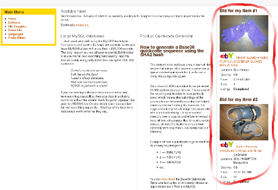

# Auction Affiliate - a Joomla! Module for eBay auctions

## _To advertise your eBay auction, direct web traffic to it and to draw affiliation revenue_

This module displays an eBay auction item in a Joomla! 1.5 web page. Use multiple modules to display more items. The auction item(s) can be your own auction, a friend's or that of someone unknown. Through this module, a visitor can go directly to eBay from your website, bid and complete a successful transaction. If you are a registered affiliate, you can make a little money too. You can choose what information about the item you want to display and optionally wether you want to enable eBay affiliation.

## Why is this module useful?

* It offers an easy way of showing your website visitors what you are selling on eBay
* Simple configuration - the mimimum is to simply enter the eBay Item number in the module configuration. There are lots of other nice goodies  to configure, by the way.
* Manages affiliation tracking of your selected eBay auction.
* Use it to direct web traffic to your eBay auction, which means that more people  will bid, which in turn means that you can potentially realize a higher final sale value. If you joined an affiliate scheme and have set this up here and this is someone else's auction, then your affiliate proceeds  will of course higher as a result.

## What does it do?

It displays the following:

* Auction item image
* Description heading text
* Date and Time the auction ends
* Remaining time before auction ends
* Number of bids so far
* Price and currency
* Location and country of item
* Auction status: Active or Completed

It also manages:

* The retrieval of the auction data
* Tracker affiliation

Supports:

* JSON and XML API encoding
* Uses cURL if PHP's file_get_contents is disabled on your web server (often the case on shared hosting servers)

